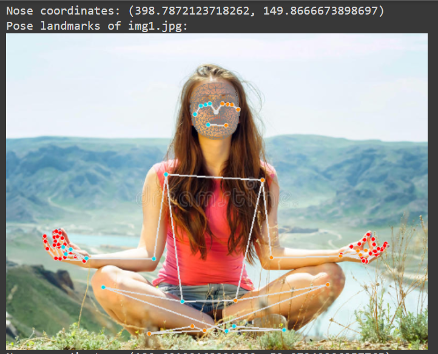

# Gym-Assistant-Pose-Tracking-MediaPipe

Note:- Please execute the notebook on colab

Human Pose Detection and Tracking. High-fidelity human body pose tracking, inferring up to 33 3D full-body landmarks from RGB video frames

Document:- https://google.github.io/mediapipe/

Github:- https://github.com/google/mediapipe

Prediction:-
1. Pose Tracking

2. Landmark Prediction:- 

